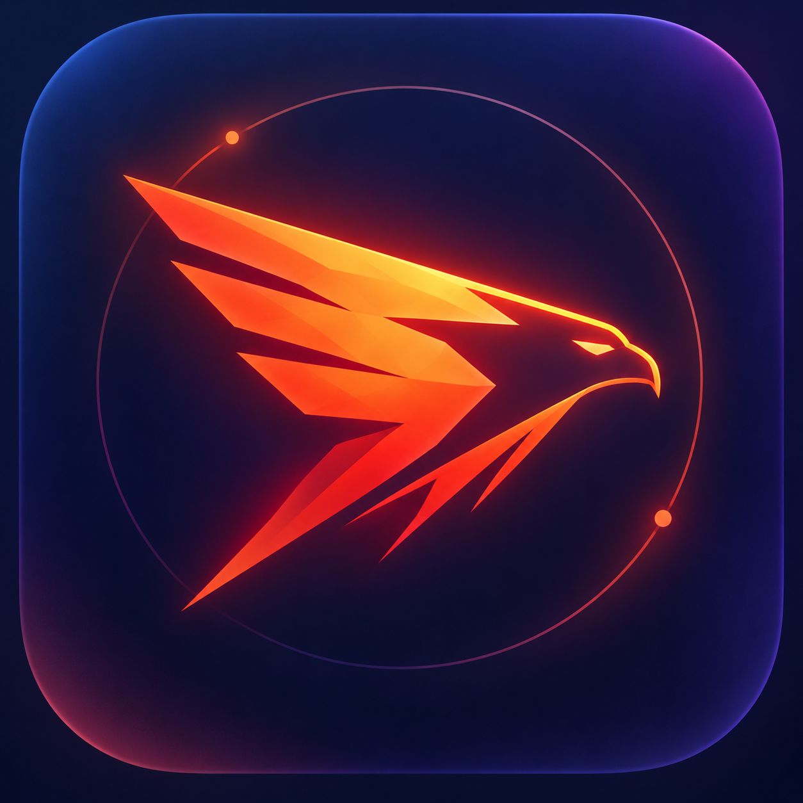

<p align="center">
  
</p>

<h1 align="center">Rarog Web Engine</h1>

<p align="center"><strong>A small engine for a big Web.</strong></p>

<p align="center">
  
  
  
</p>

<p align="center">
  <a href="docs/ARCHITECTURE.md">Architecture</a> ·
  <a href="docs/ROADMAP.md">Roadmap</a> ·
  <a href="docs/BRAND.md">Visual identity</a> ·
  <a href="CONTRIBUTING.md">Contributing</a>
</p>

Rarog is an experimental, independent, Rust-first Web engine designed around four priorities:

1. real-world compatibility;
2. low resource use;
3. strong isolation and capability-based security;
4. embeddability.

The **primary target platform is Windows**. Rarog is being designed so the engine core can remain portable, but the first production-quality host integration, GPU/compositor path, sandboxing, input integration, accessibility work and reference browser will target **Windows 10/11** first.

The workspace version is **0.1.0**. **R0 — Ember is complete**: it established deterministic rendering, invalidation, paint, embedder and platform ownership boundaries. **R1 — Flame is complete**: it replaced the bootstrap HTML/CSS paths with standards-oriented adapters, established scoped block/inline formatting foundations, connected production OpenType shaping and Windows font discovery, and broadened retained incremental rendering and damage-aware paint. **R2 — Flight is complete**: it established normalized WebIDL and replaceable script-runtime boundaries, the first SpiderMonkey adapter, events and engine-owned task/microtask scheduling, URL/origin/Fetch foundations, script-driven retained rendering checkpoints, and Windows input/IME/clipboard adapters. **R3 — Wings is complete**: bounded Flexbox/Grid work, the compositor worker, replaceable `wgpu` backend, Windows-first GPU presentation, asynchronous image decode, scrolling and engine-owned frame scheduling are protected by a dedicated exit gate. **R4 — Sky is complete**: the mandatory audit/refactor gate, process/site and navigation-context authority, bounded IPC, broker-gated privileged operations, Windows child-process loss/local IPC, the bounded Windows Site-process sandbox/Job Object policy, and the dedicated R4 exit gate are established and verified. **R5 — Web remains in milestone-exit verification**: its selected storage, Workers/Service Workers, WebSocket, media, Canvas/WebGL and accessibility workstreams are implemented, including Windows-first Storage/media/accessibility adapter foundations, while the dedicated cross-workstream exit gate and merged-`main` evidence are the remaining closure boundary.

> Rarog has standards-oriented foundations, not a claim of general-Web compatibility or standards completeness. Broad DOM/Web API coverage, compatibility qualification, production GPU/compositor maturity and browser readiness remain roadmap work.

## Current engine pipeline

```text
decoded HTML input
   ↓
standards-oriented rarog-html adapter
   ↓
rarog-dom + mutation generations
   ↓
standards-oriented CSS parsing → selectors → cascade/inheritance
   ↓
computed style + invalidation dependencies
   ↓
persistent dirty state
   ├─ unchanged → no render work
   ├─ paint-only style change → retained Layout/Fragment geometry + paint patch
   ├─ local geometry change → subtree Fragment relayout when proven safe
   ├─ text/structure/formatting-context change → retained Layout refresh + flow-aware relayout
   └─ unprovable retained state → deterministic fail-closed fallback/rebuild
   ↓
layout tree
   ↓
fragment tree + block/inline formatting foundations
   ↓
retained display list + structural scopes + stable display-item IDs
   ↓
damage-aware software framebuffer / deterministic hash
   ↓
engine-owned frame scheduling + backend-neutral frame plan
   ↓
bounded compositor worker
   ↓
replaceable wgpu upload / Windows DX12 presentation
```

The implemented R0–R5 foundation includes:

- checked DOM mutations, mutation records, document generation tracking and mutation-history pruning;
- explicit element namespaces and an atom/string ownership boundary;
- standards-oriented HTML tokenization/tree building through an `html5ever` adapter behind Rarog-owned DOM/parser types;
- standards-oriented CSS parsing plus combinators, attribute selectors, pseudo-classes, importance, inheritance and CSS-wide values;
- persistent engine-owned dirty state across mutations and renders;
- a stateful `RenderSession` with paint-only reuse, subtree Fragment relayout, retained parent/subtree refresh, flow-aware relayout and deterministic fail-closed fallback;
- scoped block formatting foundations including margin collapse, auto/min/max sizing and explicit BFC boundaries;
- scoped inline formatting foundations including shared line construction, baseline/vertical-align behavior and nested/multi-leaf inline fragmentation;
- explicit containing-block and intrinsic-size boundaries;
- production OpenType shaping behind a Rarog-owned shaping contract, plus Windows system-font discovery and a tested DirectWrite-selected face → HarfRust handoff;
- a bounded decoded-image resource abstraction with revision-aware paint identity;
- separate DOM, layout-node and fragment identities with derived/disposable layout state;
- a backend-neutral display list with clip, stacking, transform and opacity scopes;
- deterministic display-item IDs, retained-range/suffix validation, structural damage comparison and damage-scoped software framebuffer updates;
- bounded framebuffer allocation and a fallible public render boundary;
- render-stage timings, structural counters and benchmark harnesses with no performance thresholds or claims;
- `Engine`/`View`, request forwarding, host policy, UI-neutral callbacks and enforced source/viewport resource budgets;
- a normalized WebIDL IR and standards-oriented parser adapter behind Rarog-owned metadata;
- a replaceable script-runtime contract plus an isolated SpiderMonkey ESR backend with opaque realm/root identities;
- Event/EventTarget foundations and bounded engine-owned task/microtask scheduling connected to retained render checkpoints;
- Rarog-owned URL/origin/site identity and Fetch request/response/network-capability boundaries;
- R4 process/site identity, bounded Host/Site IPC, Host-owned navigation contexts/capabilities, broker-gated Network/Clipboard routing, Windows child-process launch/loss detection, bounded Windows local IPC, Site-process mitigation/Job containment and fail-closed lifecycle/recovery foundations;
- bounded exact-origin Storage-process state, typed Host↔Storage requests, transaction/checkpoint foundations and Windows Storage-process lifecycle/containment evidence;
- bounded Worker identities/execution/mailboxes, Service Worker registration/lifecycle and Host-gated Fetch interception foundations;
- Rarog-owned WebSocket semantics with Host-private backend tickets, bounded inbound/outbound queues and fail-closed close/error/backpressure lifecycle;
- bounded media resource/stream/playback ownership with replaceable demux/decoder/output adapters and Windows-first backend integration;
- bounded Canvas 2D and WebGL semantic resource ownership, compositor invalidation and explicit context-loss/resource-retirement behavior;
- a bounded platform-neutral accessibility tree/runtime with derived identities/actions/events plus an HWND-bound Windows UI Automation provider bridge that keeps engine state authoritative;
- platform-neutral keyboard, pointer, wheel, text-input and clipboard contracts with bounded Windows input/IME/clipboard adapters;
- bounded Flexbox/Grid slices with explicit fail-closed behavior for unsupported geometry;
- backend-neutral frame planning, bounded compositor workers and a replaceable `wgpu` staging backend;
- Windows-first DX12 surface presentation behind the platform adapter boundary;
- bounded asynchronous image-decode ownership, stable scroll-tree identities and engine-owned frame scheduling;
- `rarog-platform` plus the Windows-specific `rarog-platform-windows` ownership seam;
- deterministic DOM/style/layout/fragment/display-list snapshots and framebuffer/signature hashes;
- Windows-primary CI, Linux portability CI, an explicit Rust 1.85 MSRV check, dedicated SpiderMonkey jobs and immutable action pins;
- dedicated automated R0, R1, R2, R3 and R4 exit gates, with the R5 cross-workstream gate wired into Windows-primary and Linux-portability CI during milestone exit.

Rarog deliberately does **not** claim general Web compatibility, standards completeness, production security, performance leadership or browser readiness. Those are later milestones with their own measurable exit criteria.

## Platform strategy

**Windows is first, not Windows-only.**

The engine-owned Web platform code stays independent of Win32/WinRT/D3D-specific APIs. Windows-specific code lives behind narrow platform adapters so Linux and macOS ports remain possible later without forcing the core architecture to follow the lowest common denominator.

R1 made the first production text platform path concrete, R2 extended the Windows host seam through normalized input, IME and clipboard adapters, R3 added the first Windows GPU/compositor presentation path, R4 added bounded Site-process lifecycle, IPC and sandbox/process containment foundations, and R5 adds Windows-first Storage-process, media-backend and UI Automation accessibility bridges behind Rarog-owned semantic boundaries. Broader release-quality host integration remains later roadmap work.

The first reference browser, **Zorya Browser**, is also planned for Windows first.

## Workspace

- `rarog-types` — shared geometry/color/value types
- `rarog-resources` — bounded decoded-resource ownership and revision identity
- `rarog-dom` — DOM arena, checked mutations, mutation records and generation tracking
- `rarog-events` — Event/EventTarget registration and dispatch foundations
- `rarog-html` — standards-oriented HTML adapter plus Rarog-owned input/diagnostics boundary
- `rarog-css` — standards-oriented CSS parsing, selectors, cascade, computed style and invalidation primitives
- `rarog-layout` — derived Layout Tree, Fragment Tree, block/inline/flex foundations and text layout
- `rarog-text-opentype` — production OpenType shaping adapter behind Rarog-owned contracts
- `rarog-webidl` — Rarog-owned normalized WebIDL IR, validation and parser frontend boundary
- `rarog-url` — Rarog-owned URL, origin and site identity primitives
- `rarog-process` — Rarog-owned Host/Site/Storage process identities and bounded site-assignment topology
- `rarog-storage` — bounded exact-origin storage-process state, typed request, transaction and checkpoint foundations
- `rarog-workers` — bounded Worker/Service Worker identity, lifecycle, execution and message ownership
- `rarog-websocket` — bounded WebSocket semantic handshake/lifecycle/message/queue contracts
- `rarog-media` — bounded platform-neutral media resource, stream and playback ownership
- `rarog-media-adapter` — replaceable demux, decoder and output backend contracts with opaque tickets
- `rarog-canvas` — bounded Canvas surface/context/state ownership and external-context leasing
- `rarog-webgl` — bounded WebGL context/resource semantics and explicit loss behavior
- `rarog-accessibility` — bounded platform-neutral accessibility tree, actions, events and invalidation
- `rarog-ipc` — versioned Host/Site IPC envelopes, fixed bounded wire codec, correlation, backpressure and disconnect semantics
- `rarog-broker` — Host-owned bounded capability grants, authorization and process-scoped revocation
- `rarog-host` — portable Host control plane for document/Site assignment, bounded navigation contexts, channel binding, context-scoped privileged routing, authority revocation and recovery
- `rarog-fetch` — bounded Fetch values and embedder network-capability boundary
- `rarog-script` — replaceable script-runtime, realm and rooted-value contracts
- `rarog-script-spidermonkey` — isolated SpiderMonkey adapter behind `rarog-script`
- `rarog-scheduler` — bounded task and microtask scheduling primitives
- `rarog-scroll` — bounded scroll-tree identities, geometry and offsets
- `rarog-paint` — retained structural display list, stable IDs, damage tracking and software rasterizer
- `rarog-compositor` — backend-neutral frame planning, scheduling and bounded compositor-worker contracts
- `rarog-compositor-wgpu` — replaceable `wgpu` upload/presentation staging backend
- `rarog-platform` — platform-neutral host, font, input, clipboard, media and accessibility capability contracts
- `rarog-platform-windows` — safe Windows-specific font, input, IME, clipboard, Site/Storage process lifecycle, media and UI Automation accessibility adapters
- `rarog-platform-windows-native` — isolated low-level Win32 process creation/mitigation/Job Object and native adapter boundary
- `rarog-engine` — rendering, persistent incremental session, accessibility derivation, event-loop bridge, observability and embedder boundary
- `rarog-shell` — minimal CLI test shell

See `docs/ARCHITECTURE.md`, `docs/ROADMAP.md`, the milestone backlog/exit documents under `docs/`, and `docs/adr/`.

## Development checks

The same core checks used by CI include:

```text
cargo fmt --all -- --check
cargo check --workspace --all-targets
cargo clippy --workspace --all-targets -- -D warnings
cargo test --workspace
cargo test -p rarog-engine --test r0_exit
cargo test -p rarog-engine --test p1_exit
cargo test -p rarog-engine --test r01_correctness
cargo test -p rarog-engine --test r1_exit
cargo test -p rarog-engine --test r2_exit
cargo test -p rarog-engine --test r3_exit
cargo test -p rarog-engine --test r4_exit
cargo test -p rarog-engine --test r5_exit
cargo check --manifest-path fuzz/Cargo.toml --bins
cargo run -p rarog-shell -- examples/hello.html rarog.ppm
```

## License

Rarog is dual-licensed under **Apache-2.0 OR MIT**, at your option. See `LICENSE-APACHE` and `LICENSE-MIT`.

## Project status

**R0 — Ember, R1 — Flame, R2 — Flight, R3 — Wings and R4 — Sky are complete. R5 — Web is at milestone exit.** All selected R5 implementation workstreams are complete; the dedicated cross-workstream exit gate and final merged-`main` verification remain the closure boundary. R6 compatibility qualification has not begun. Rarog remains experimental and does not claim browser readiness, AppContainer isolation or Chromium-equivalent sandbox maturity.

Created by **Stanley Lloyd**. Contributions are welcome; see `CONTRIBUTING.md`.
